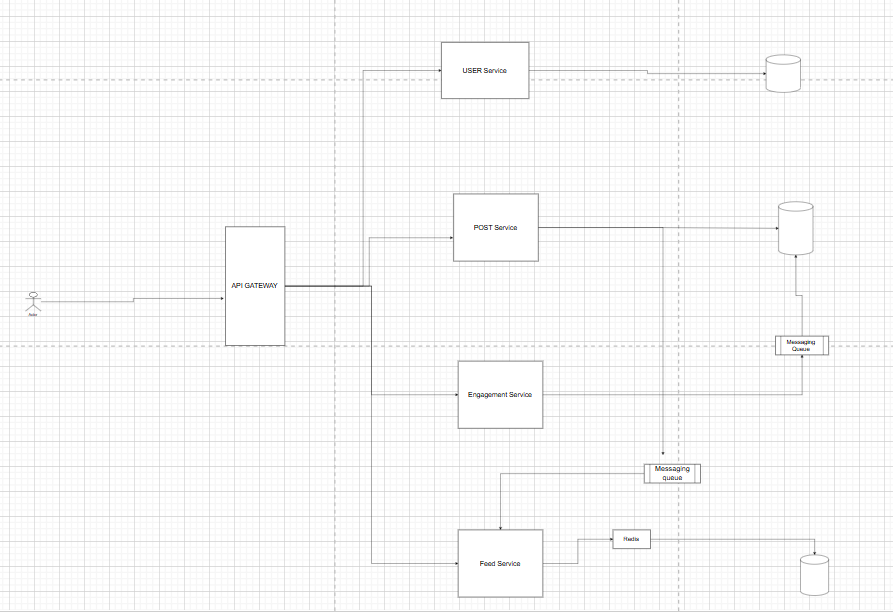

### Instagram system Design

after all the functional requirement clarification we can propose high level estimation

DAU(daily active users): 200 Millions

50% users post sometimes daily, and on average they post 1 post on instagram with 2 photos on average

daily post write requests=> 100 millions    144 => 864
                                            

post write request per seconds=> 100*10^6 / 24*60*60 => 10^6/24*36 => 10^6/864 => 10^4/8 => 2k requests per seconds on average

through put we might need is => 10 times of average requests per second => 20k 

Storage estimation:

suppose size of one post including image is => 2MB image + 10KB contents => 2000 KB + 10 KB => 2010 KB => 2.01 MB => approx 2MB

so daily storage needed => daily active users * 2MB => 200Millions*2MB => 200*10^6*2*10^6 => 400TB daily which including S3 storage.

Note: we can handle 50k concurrent websocket connection on one server with appropriate RAM and CPU capcity and can handle around 1k-2k http requests per seconds.

#### API Design to fullfill the requirements

1. POST: v1/user/create

payload:{
    name,
    email,
    password,
    userName
}

response:{
   jwrt_token,
   refresh_token
}

2. POST: v1/user/login

payload:{
    userName,
    plainPassword
}

Note: networks encrypts the data while sending over network so no need to worry about password leakage, in backend we use bycrypt library with salt roation which generate a unique has and stores that hash value in db. in while login we just compare bycrypt.comapre(actualPassword, hashedValue), hashedValue contains salt key.

3. POST: v1/post/create

payload:{
    contents,
    tags: Array<string>,
    imagesUrl:Array<cdn images urls>
}

response:{
    success: boolean
    errorMessage: string // if encounter any error
}

4. GET: v1/post?postId=2332

response:{
    userId,
    content,
    imageUrls,
    tags,
    likesCount, 
    commentsCount
}

5. GET: v1/feed?user=4325 & page=1 & cursor_id= 676567

response: [{userId, content, imageurl, tags}] // gives list of posts of other users which are connected with user 4325

6. POST: v1/comment
payload:{
    postId,
    commenttext,
    userId
}

response:{
    commentId: string
}

7. POST: v1/like

payload:{
    postId
}

We have almost covered all api's design now we will build system slowly and scale it for millions of users

Note: we have assumed that each post will be having unique id in distributed system , how do we generate unique id, there are manyn ways to generate unique id like UUID, and twitter snowfalake, based on the reqquiremengt u should choose one, if need time based increased id we should choose twitter snowflake instead of UUID, which is random

Diagram for instagram design

Now we will build system step by step

Authenticationa and authorization: We need to make a seperate service for issue jwt token using private key and share public key across all micro service which help to identify validation or actaul user.

User service is responsible for creating user and saving user info like bio, profile pics etc. if we want to scale user micro service then we need to use load balancer in front of user service and add more instances of user service and route the requests.

Now let's come to post service which is responsible for storing post related data, fetching posts for given user or updating post data.

When user want to post some post which has multiple images and some text content and hashtag, after writing and uploading the imaages user clicks on post button which call backend api, and the resquest is redirect to post micro service, and post micro service send the pre signed s3 urls, it sends two url for each images, one is private with some expiration where user can upload the image directly from client side and another url is public which help us to access that image. once all images uploaded successfully we again call backend api to update the meta data in db and push an event for feed service so that all the connection of that user who posted the post, will get updated time line.

What happens when api fails when we try to upadte the meta data on server side after image uploaded, we can implement re try from client side using idempotency (generated by client).

we gonna user messaging queue when we send an event to feed mirco service, feed mircro service picks each events from the messaging queues like kafka, and process it

In event we will send following details

{
  senderId,
  postInfo:{
    postId, 
    imageUrl,
    contents,
    tags,
    commentsCount,
    liksCount
  }
}

feed micro service will consume above event and calls the user service to get all it's followers info and updates their time line

in redis we keep latest timeline info for each user

LPUSH  timeline_userId: [{info}, {info}].

so if followrs are less than 500 then i can use fan out approach so that we will write 500 times in the redis and also update the feed data based for durability. we gonna use cassandra no sql for storing time lines of the users. when user opens the app we directly gets the time line info from redis so it feels fast loading other wise it might take some time to load time line if we fetch from the db. when user scrolls and consums all the post stored at redis level then we call the db based on cursor based pagination.

if some celebrities upload the post then we can not do fan out approach since some celebrity might have 1 millions followrs so updating their time line will fade the redis write operation so it's better we keep there post in redis seperatly so whenever some user goes to it's time line we see it's connection to whom he follows , if he follows some celebrity we check it's cache and pick top few recent post and merge them with normal users post and send it to client response as time line response.

in this case some latenyc might increase so it's when and how to fecth posts of celevrities, we migt fech after first 10 post sent client and lazly we can build the time line.

Now let's come to like and comments functionality as we like some one post or comments some one post, then other gonna see that so what happens in the backend when we likes someone post, then we call the v1/like api with payload:{
    likedBy: userId
} to the server, then api gate way routes that request to engagment micro service and it validates the request using jwt public key, then based on like or comment action it update the respective tables like or comment in db and push an event to kafka which will be consumbed by feed service to update it's database and update the comments or like, and same will be consummed by post service where we keep post info along it's like and comments count, so we gonna increase like or comment counts there.

Note: it's optional to keep whole comments in the time line db as we might be duplicating alot of data, so can just keep the counts only for visibilitya and when user clicks on see comments then we call the api which gonna hit the engagment microservice to get list of comments based on pagination.

Notifications service: when someone likes my post i get in app and push notications like ankit,sneha, and others liked you post.

so this can be implemented at engagment micro service when someone likes or comments we are pushinh that event in messaging queue which is consumed by feed micro service, also we can add one more service notifcation micro service which will consume the event from the queue and which was pushed by engagment service, that notification micro service can send push notifications using fire base for andriod and in app notications using server sent event connection or websokets.

Doubt: can two micro service consume an event from same messaging queue and delete once both micro services aknowledge that they consumed it successfully.

Answer: above doubt is use case of pub/sub architecture, using kakfa topic we can achive it or using redis pub/sub also

Topic: post-posted
Consumer Group A (Notification service)
Consumer Group B (Feed service)

DB Schema

User service

user table
user_id | user_name | hashed_password | profile_pic_url | bio_text

Post Service

post table

post_id | created_by | content | type | likes_count | comments_count

Engagement Service

likes_table

like_id | liked_by | post_id | created_at

comments_table

comment_id | commented_by | post_id | created_at

Feed Service

No Sql cassandra db

feed-table

user_id: [{
    post_id,
    posted_by,
    postInfo,
    etc
}]

Extra:
How does cdn caches images: first we upload the images to s3, and we have some reverse proxy like cloudfare which act as a cdn, they have servers at multiple location, whenever user try to access something from our server, first cloudfarfe recieves the requests and check if that request is cached or not, if it is cached it can directly be served from cdn without hitting our server, like html , css and some static things we can cache, when we send response from our server we can mention ttl for cache, therefor cdn caches for that particular time also browser can cache images and etc.
