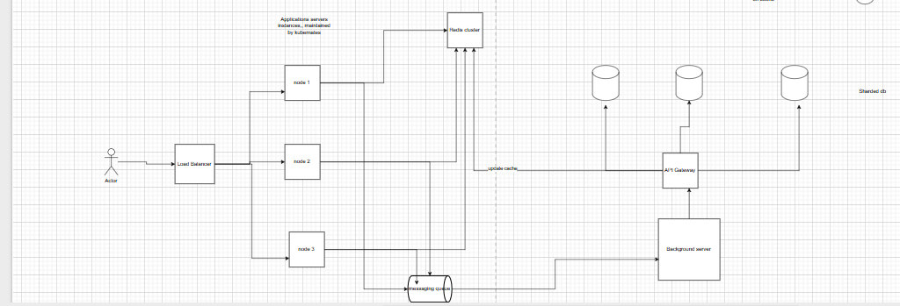

### Design a typeahead (autocomplete) similar to google suggestion

Requirements
functional requirements
1. whenever use types we need to suggest top k suggestion with low latency
2. response should come in millisecond
3. we support user specific and trending across you region

Non Functional requirements
1. system should support millions of user's 
2. system is high read and can have eventual consistency.(CAP Theorem)

Solution:
Calcukation Estimation

suppose we have 100 millions active users daily, and each user send 100 search query in average

QPS: 100*10^6*100 per day = 10^10/24*60*60 => 10^10/3600*20 => 10^10/72000 => 10^6/7.2 =>10^5 approx => 100 Thousands request per seconds

Storage: suppose we are searching 10 long word on average
=> 100 million user * 100 request per day * 20 byte on average => 200000*10^6 => 0.2 TB per day => 2.4 TB per year

Design

We will use no sql database to store searched word rank and push it to trie if it crosses some threshold, so storing these many of queries will be difficult in one db server so can shard the database based on regions like each country has it's own db, even further we can shard if data base become large.

In db we can store word(query search count) but that does not represent relvency suppose world cup 2025 might have been searched 100M times in 2025, but now in 2026 or coming years we might see very rare search of that word so we can not show in the suggestion otherwise it will make no sense to users so again we keep timestamp based count in db and based on that we calculate the rank, older couunts comtributes less to rank

Example:
Db schema

word | [count in given interval] -> 2024-08-11, 11AM-12PM
       [count in given interval] -> 2024-08-11, 12PM-1PM

    
on hours basis we can store the count, so it will optimize the space as well, if we keep all the time stamp and take count of last 2 hrs time stamp, that will be come expensive as well will consume more memory.

How do we reduce the latency and optimze it

We use trie data structure in memory(Server RAM, each server has trie in it when it's running). in trie data structure we keep top k suggestion as well along with node so it's easy for search. in backhground job we timely update the trie on each server also keep latest copy of trie in persistent storage like s3, cache so that if sever fails and retstart again we can fetch the trie from persistent storage.

Also we maintain one hash table in cache for frequently asked queries

query | suggestion list

y | ['you', 'yours', 'yo'] etc
m |  ['mom', 'mother, monsoon] etc

so whenver we get request from application server we check in the cache for searched word(query word) then return the suggestion if there is cache miss we need to search in trie for given application server trie. and update it in cache.

How do we handle if number of nodes in trie is so much.

first thing we do not store each and every work in trie, there should be some threshold on ranking then only we keep it in trie.

another optimization we can do is keep seperate server to maintain trie and scale that server individually and keep multiple shard of  that server.

If we update some word in db and background server(cron job) updates the trie, how do they update it.

first we update the count in db based on which on in which bucket it goes after that we call each server to update the trie, we search that word and updates it's rank and the parent also re calculate the it's suggestion again as we have upadted the rank of it's child which will impact the suggestion of that parent node.

To avoid single point of failure we should keep cluster of cache like redis cluster and keep replciation of each shared database in case some goes wrong we can choose different db as a leader.

 whenever we recived a request from client we read the suggestion and sent it back to client, also we publish an message event to queue(kafka) which will be consumed by background processing server and update the respective db and trie in the servers.

 How do we handle user specific searches
 We can not maintain trie for every user's it will cause memory crash
 we maintain one more table which keeps record of all searched word with there counts in db 

 table Name -> userSpecific_Suggestions

 key | value

 userId | [{word, count, lastTimeStamp}]

 assume we consider the count and last seached time stamp for rank calculation so we pick top k from the user specific 

also we keep those user suggestions in cache as well and keep TTL for 24 hrs, if user is inactive from last 24 hrs we remove from cache and again need to fetch from db if incoming requests comes

again updating user specific table should async job as we want low latency with eventual consistency

Diagram:

Suggestion from ChatGPT for improvement

QPS: we should consider peak time traffic instead of average requests for calculation

You have sharded db based on region but that not effient so we need to choose sharding key (region + timestamp)

mention eviction policy LRU as iff cache storage full then we need evict the entries to store new entries

you mentioned that we will send updated trie to each server which cause tight couping we need to maintain which server is down and all, it's better we published changes to S3 and update version , from there it will be published to each application server.

Also we need of rate limiting and all standard system design thinking
