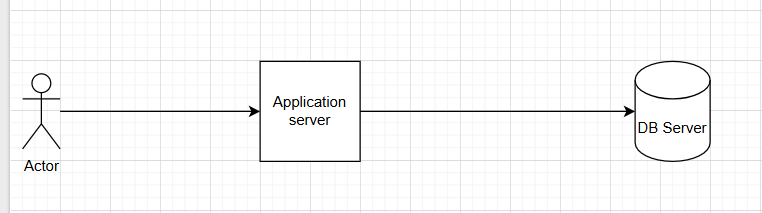
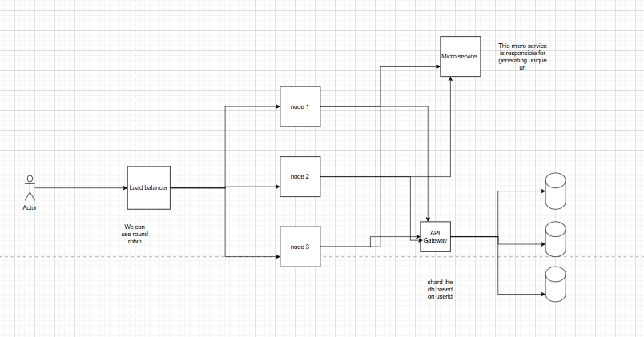

### Design a URL Shortener

Requirements gathering
Functional requirements
1. the system should able to generate a unique short url for each long url
2. system should support alias and analytics for better business decisions
3. short link expiration date can be set from user, default expiration date will be 10 years

Non  functional requirements
1. system should give 99.99% availability
2. latency should be less 
3. should able to scale for mission of user's 

Me: let's start from basic system and then we will scale the system
Interviewer: okay.

Me: let me do some rough calculation for number of requests per seconds and storage needed for the system.

Suppose we are receiving 1:100 write and read ratio per user on average per day.
suppose we have active user's 10 Millions.

total write requests: 1*10millions*1 day = 100,0000/(24*60*60) = 10^7/72000 = 10^4/72 = 10^3/7  ~ 130 request per seconds
total reads per second: 10*write request = 1300 request per seconds

storage estimation: 130*60*60*24*365 * per record storage= 4billion*100kb = 4TB per year => 40TB storage needed for 10 years

we are done with storage and request estimation

Note(for my understanding): we can keep around 5000-10000 light request per application server and 4TB storage, and 32 GB RAm and 8 core cpu.

Interviewer: okay.

Me: 
Diagram-1:

In above diagram we have kept one application server and one db server, in db we kept one shortUrl  and one user table

Db Schema

User
 userId: INT primary
 username: varchar(300)
 lastname: varchar(50)
 createdAt: time stamp in utc
 updatedAt: time stamp in utc

ShortUrl
 id: INT auto_increment primary key
 longUrl Varchar(1000)
 shortUrl varchar(10) unique
 clickCouunt: INT
 userId INT not null ->> foreign key

 How do we generate unqiue short url and decide what will be the length of short url (we want to keep fix length)

 We need 40TB storage which means 40 billions unique entries in db => 4 * 10^10

 So suppose we use incremental id which is primary key in shortUrl table, it can server uniqueness, which seems good, but we want fixed size length in alphanumberic.

 We can do base 62 encoding for the primary keu, whenver we insert new entry in db we generate a new incremental id and encode it in 62

 How long is enough:
 62^n = 4*10^10  => 60*60*60 ...*60 => 3600*60 => 216000 => 2*10^5 * 2*10^5 => 4*10^10 => which means length of 7 is good enough to generate required uniqye short url.

 problems with above approach

 we can not scale it after sometime as we are inserting every data in one db only so searching and write will be expensive and latency will increase, after some time our 7 length limit will be exhausted as we will increasing id every time.

 second problem is that we can guess about next short url, which breaks security protocols.

  we will not able to shard the database to scale our system horizontal so we need to thnink of other approach.

  Approach 2: 
  We will make a different micro service which will be responsible for generating unique id in distributed systems as we will be having multiple shards based on user id.
  We can generate Id using maintaining the counter at server side, but if server goes down we will loose counter, for that need to maintain counter assignment in zookeer, we need to have multiple servers inside the zookeeper so that it does not become single point of failure also assign counter start and end for each service and maintain in zookeer.

  Cons: Maintaing counter in zookeer for each server become complex, we need to learn that
  

  Approach 3: 
  We need to use twitter snowflake id generator to scale better.

  41 bits for time stamp | 5 bits for data center | 5 bits for node | 12 bits for sequence

  we can represent every snowflak id in 64 bits, if convert it to 62 base we might get length of around 10 char.

 twitter snowflake id generator scale better in distributed system 

 Diagram-2:
 

 No we are able generate unique id and able to scale db and server as well.

 How to reduce latency:
 We can use cache(redis) with TTL for frequently used short url

To increase throughput we can scale the number of servers deployed.

How we will handle alias support:

if we have alias we need to search in db does any short url exists with same alias then throw error otherwise write in the db, but it will be more complex if we have sharded db, because we need to search in each shard which is not scalable, so it's better we create one more sql db where we keep all alias, so we can hit that sql which will fast because we have less alias.

how we can track analytics for each short url

Whenever we read short url we can read it from cache or read from db if cache miss, we can publish an event to queue(kakfa) and can process them later and unpdate the clickCount in the DB, we will be having a different server for analytics which will get the event from messaging queue.

We can add an cron job to clear expired entry from db.
