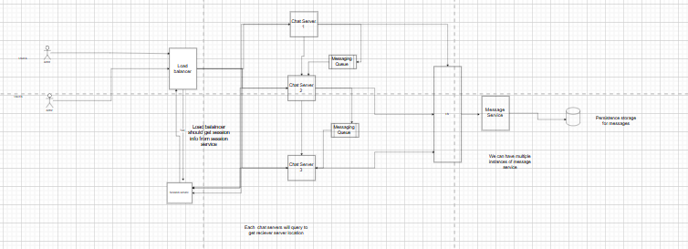

### whatsapp system design 

I have mentioned the requirements in the readme.md

before jumping to the solution let's do little bit of estimation in terms of memroy and requests per seconds

1. assume we have 200 millions active users who are using whatsapp app chat
and 50% of them are active => 100Millions

suppose one user sends 100 messages on average then 10 Billions chat requests will go to server

Write messages per seconds = 10billions/24*60*60 => 10^6 => 10,00,000 => 1 millions write request per seconds so we need higly write throughput db server , so it's better to think of cassandra no sql dbs

storage estimation:
let's assume in one message on average wr have 100 characters so 100 bytes in one message
so daily stroage required => 100 millions users * 100 messages* 100 bytes => 10billions*100 => 1TB storage

so it's obvious that we need to support sharding in db to storage such large volumne of datas for long time.

Note: Please make sure you under stand sharding concepts very well.

basically we shard the db based on conseration id since we need all messages of same conversation in to same shard , other wise multi shard query will be slow and eventually it will cause more consistency.

High level architecture

In above diagram we have given high level archiecture.

#### API Design:
first let's discuss what api's we need to implement then will move one by one requirements

1. send messages or recieving messages => use websocket connection to achieve this

POST: v1/update_user_info
payload: {
    display name,
    profile image url(cdn link),
    status_description
}

response:{
    success: true
}

Let's build system for small to large as per requirements

1. support one to one chat
once we open the chat app, we send a http request  with upgrade header and server responds with 101 status code if it successfully establish connection, if some how connection fails we can retry or fall back to long polling http calls.

Suppose websocket connection success then it will be persist until client or server goes offline, now each future requests should go to same chat server if we have multiple chat servers, for that we create session service which keeps the entry of user id and there connected server address so load balancer can re direct connection accordingly, if no entyry found, load balancer sends request to health server and updates to session server redis cache. make sure you remove offline chat servers from load balancer pool so that it does selects offline chat server.

Suppose user A opens the application then we send websocket connection request to server, it connects to one of the healthy chat server and updates the session service.

Now we want to send the message to user B, then we type some message suppose "happy new year" then press send button.
Note: here we discussing text message only, in case of media we need s3 cloud storag to store images.

Once user clicks on send button, message to goes to that particular chat server which has websocket connection, now we not going through load balancer, we directly goes to chat server and initaite a write request to messageService which is responsible for writing messages in database, once we have written data in db then we call session Service to know user b has socket connection with which chat server, we will get the chat server location and send the message to that server which send the message back to user b as it has persistent connection, once user b device rerieves the message, it has message id as well which is generated at server side, user B send aknowledgement back to chat server of B, and which send update request to message service with message id, and inform chat server of A to inform user A that message has been delivered.

once user B open user A chat then we send an event of message read to that conversation id and we update db and inform the user A through chat server of A.

In above case we have not handled offline use case, what happens when user B is offline, then we need to use messaging queue, there we gonna push all the messages, and once user B comes online, it makes the connection with any chat server, let's say with chat sever 2, then chat server 2, checks do we have any pending messages in message queue like kakfa and send it to user B if has any.

2. let's support group chat as well.

Whenever we create a group we send a http request to server and it creates a group and adds the member in it as per client request. later on as well we can add members in the group, so we have post request which gonna send to Api gate way and it will further route the request to group service which is responsible for group info only.

now suppose i send some message in the group then it should go to each and every member of group, basically what happens whenver we send message in group then message goes to chat server of user A, suppose user A only typed some message and conencted with chat server 1, then message goes to chat server 1, then again we send message to message service which gonna write  in the db. after successfully write we can send sent aknowledgement to user A, which means messages sent by user will not be lost if user A has goen offline of anything happens to user A. then chat server 1 calls the group service to get list of all members in that group and send messages to them using below two approaches

Approach-1. fan out from chat server => this approach is good when we have less members , but it will create many problem if we have large number of members.

Approach-2: kakfa based fan out, actually chat server 1 pushes the message to messaging queue like kakfa instead of pusing directly to chat server then we might be having multiple worker we picks message from kafka and based on message they to fanout on there end.

3. how do we handle offline, online and last seen.

so what happens when user is online it send the heart beats to chat server and chat server updates status in redis for that particular user, also make sure that redis is accessible from every chat servers so they can read or write, i means we can create one more service which will keep online, last seen  etc info for each user, whenever we opens someone chat we send an event through websocket to chat server that please tell me the what is status of that user, it check in redis and return status, and also it should keep pinging status in each 4 to 10 seconds so that whenver user goes offline then it updates same in the UI.

4. typing indicator
When someone types a message to us whatsapp use to show typing... indicator , suppose user A types something to user B, user B sees typing indicator. what happens behind the scene is that user A push an event to chat server 1 (websocket connected server with A) that please update user B that i am typing here we directly send that event to user B through chat server of B with using any kakfa use cases.

#### DB Design
Now we have gone through api design, then high level design now it's time to deep dive little in the db design

SQL DB=>

User Table
userId | name | mobile_number |country | img_url

connection_mapping

group_table
group_id | group_name | created_at 

group_members_mapping

id | group_id | user_id | is_admin

No Sql db for messages storing

Cassandra

messages
message_id | conversation_id | created_at | text | sent_by | type 

indexing on message_id, conversation_id

#### End to end encryption
chat application generated public and private key on device level and public key is listed at server so that any one can encrypt teh messages and send it to user without exposing private key to server.

Hope you might have get basic idea of how whatsapp system is working behind the scene
