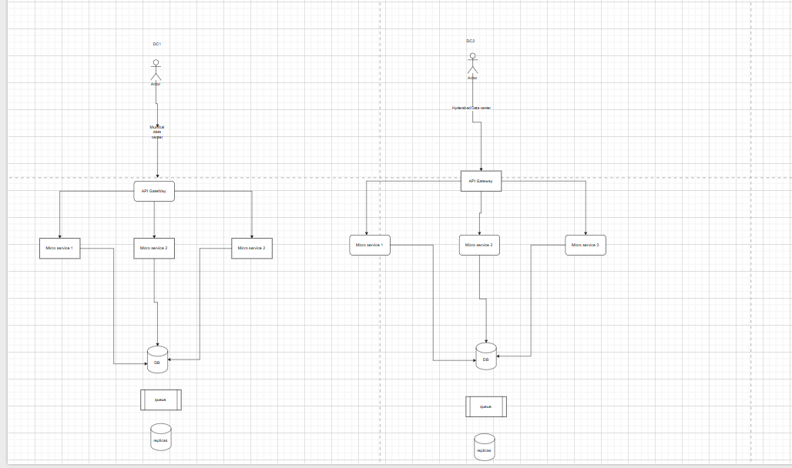

## How to make highly available and resiliant system

Diagram for your reference

### Active-passive architecture
In this architecture we have deploy our server to multiple data center but we keep one data center as primary data center where all writes and read query goes, in case of data center failure we send requests to other backup data center, in some approach of active passive we send reuqest to nearest data center but write query goes to primary data center db, and read query we can read from individual data center.

Pros: 
1. have less complexity and good for small and mid size companies
2. strong consistency achived in simple way 

Cons:
1. latency can be more if request travelling from long distance
2. difficult to scale when user base increases, as we have only one primary write db

### Active-Active Architecture

In this architecture we have multi master database each data center can write there request in their data center db and replicate it to other data center db using asyn or syncronise manner (based on requirements), as async replication reduces the latency and have eventual consistency and in syncronized replication we have strong consistency with high latency. if one data center goes down all request will be routed other availabel data center.

props:
1. good when we want scale our system for millions of user's
2. more resiliant than active -passive architecture as in active -passive down time is more compare to active-active, as in \
active-passive we need to select master db after primary data center is down.

cons
1. need to compromise latency or consistency in write requests.
2. need to resolve comflict in multi master architecture data base

Note: for conflict resolution generally prefer unique UUID primary key instead of incremental id, if there is conflict with same primary key, choose with lastest time stamp.

