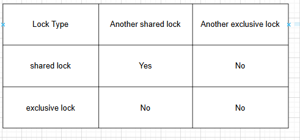
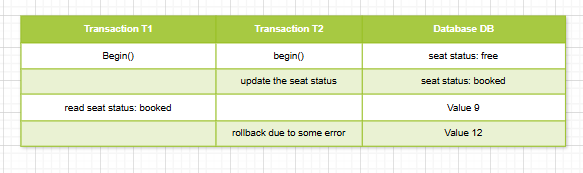
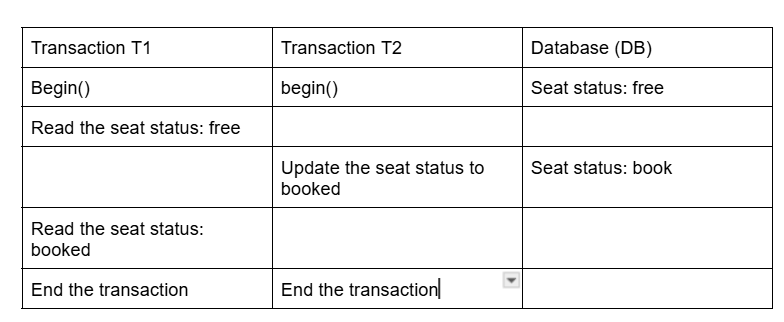
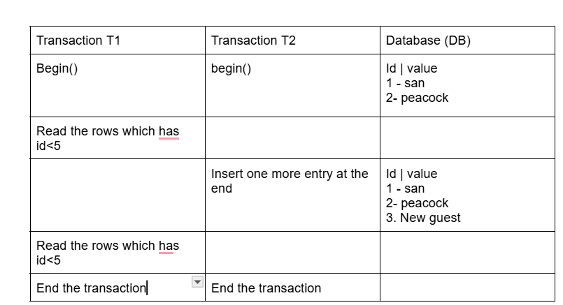
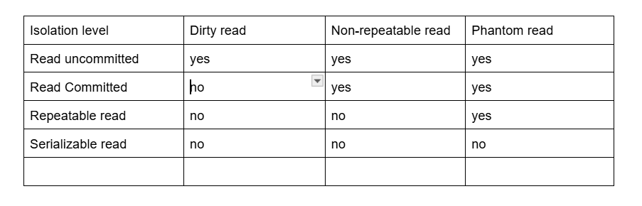
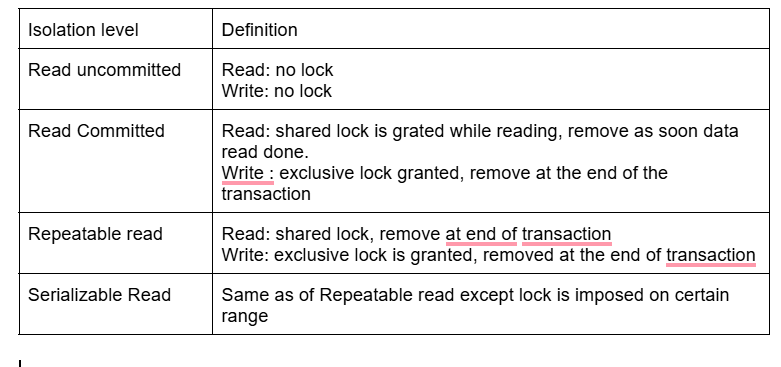
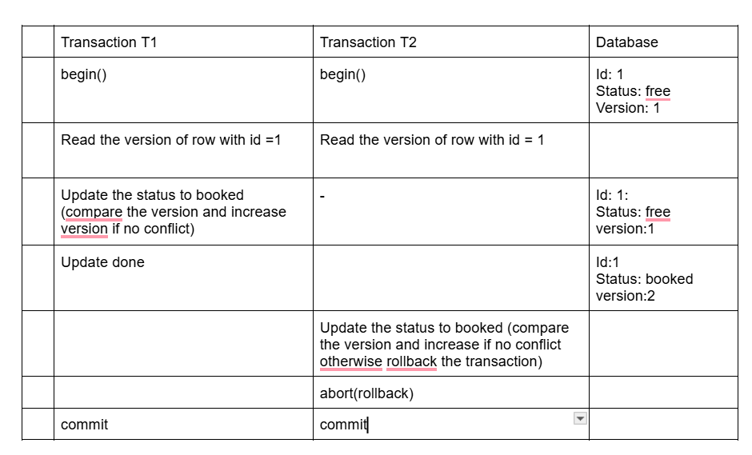
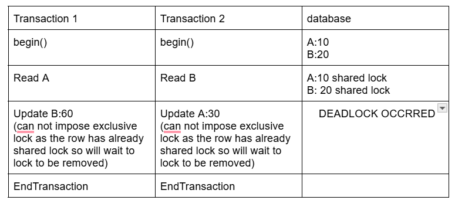

### Concurrency control in distributed systems

Let's think of a problem , how does bookmyshow or paytm make sure that seat will be allotted to one user only not to many user.

if many user's are try to access shared resource then we need to handle it properly that is know the concurreny handling.

If we have only one server and one database we can handle this using database lock so that other request can not modifiy the same row if it's being modify by some other request.

if we have many server and one database server then also above approach will work fine

above will fail if we have multiple database server (in distributed system).

Note: Before going on the approaches we should be aware of what is transaction (follows ACID properties).

#### What is db locking 
this make sure that no transaction updates the locked row in the database
there are two types of lock on data and below is the list what applicable and not
Shared Lock: mostly used when we are reading from the db.
exlusive lock: mostly used when we are updating the db row

#### What is isolation level
each transaction will be executed in isolation , will not interfare other transaction in middle.

##### What is Dirty Read
Suppose T1 transaction read the data from db with row id  = 1 and same row is being updating by another transaction T2, T1 will read and it might be dirty if T2 failed and rollback the changes.

##### Non Repeatable read
In one transaction we are reading one row data multiple times, then there are chances that row data will be different in one transaction.

##### Phantom read 
Suppose a transaction executes the same query, multiple times , and there are chances the same query might return different data.

#### different isolation level in the locking system

Note: MySQl uses repeatable read lock by default, we need to define the which lock we want apply before starting the transaction.

SQLite uses the serialize lock by default , does not support configurable locks.

#### distributed Concurrency control

Now it's time to handle locking machanism in the distributed system.

1. Optimistic Concurrency control (high concurreny)
   i. read uncommitted
   ii. read committed.
2. pessimistic concurreny control (low concurreny)
   i. read repeatable
   ii. serialize 

##### Optamistic concurreny control 
MySQl keep version column inbuilt
this approach is good for heavy read
in the optamistic concurrency control we try to avoid the conflict without imposing the lock at the start of transaction insead we rollback or commit based on versioning system.

Optimistic Concurrency Control (OCC) is a concurrency management strategy that assumes multiple transactions can frequently complete without conflicting. Instead of locking resources, OCC allows transactions to proceed independently and checks for conflicts only at commit time.

##### Pessimistic concurrency control
in the pessimistic concurrency control db has repeatable or serialize locking system.
Pessimistic control (PCC) prevents conflicts by locking the resourcess while txn is in progess so that other txn can not modify it.
in the PCC transaction will wait till resource get free from lock by default, we might add timeout as well

we do not need diagram for this(_please refer notebook).

In the PCC deadlock can happen but can not happen in OCC
see below usecase for more details on deadlock

Difference between OCC and PCC

1. PCC has higher isolation level compare  OCC.
2. deadlock can happen in PCC but not in OCC.
3. PCC has lower concurrency compare to OCC.

#### 2 phase locking system of pessimistic concurrency control.

Please note that two phase lock is different than two phase commit approach, mostly two phase commit is applicable in distributed system but two phase lock is applicable in single database.

In two phase lock, in first phase number of locks will increases in the transaction and then it reduces.

For Example:

Begin Transaction()
X(A) -> Exclusive lock
S(B) -> sharded lock
execute some business logic
remove lock from A
remove lock from B
End Transaction

In the 2 Phase lock also deadlock can happen.

there are some machinism to overcome the deadlock 

1. using timeout: on each transaction we should have timeout, if transaction is taking more than that threshold time then we need to abort that transaction, but this also comes with a limitation, some valida transaction might get time out due to heavy calculation.

2. (WFG) weighted for graph
We denote each transactiona as a node and create a directed graph, each direction shows dependecy , if there are some cycles then for sure those node involved in the cycle will be part of deadlock. 

so periodically one alogithms will be run and will detect the cycles and find out the deadlock if any, to remove dead lock we need to remove the one node (abort one transaction) from the cycle based on some criteria
i. how much efforts needed to rollback the changes
ii. the transaction involved in how many cycles
iii. how much efforts already done and how much needed to complete the transaction.

