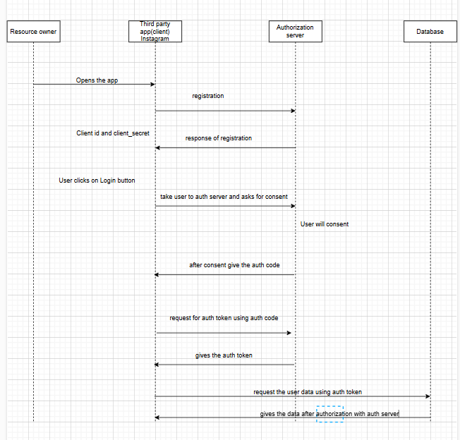

#### Whats is oAuth2.0 and when to use it.

Introduction: when third party wants some data from your logged in account there we need oAuth protocol.
i.e on the instragram you can login via gmail , right how that is even possible

To give third party authorization there are some approaches that we gonna discuss 

1. Authorization code grant (more secure and widely used)
2. Resource password credentials grant
3. Client Credentials (Machine to machine use)
4. refresh token
5. implicit grant(deprecated , earlier it was used on frontend side)

#### Authorization token
 first third party (client) do the registration with authorization server from there it gets the client id and client secret(only client and authorization server knows). in step 2 client shows the options for login once user (resource owner) clicks on the click button, it takes to authorization server and gives the authorization code once resource owner gives the consent, with the help of auth code, auth token and refesh token is generated that will be used to retrive the resource data from database.

 See Below diagram for better understanding

 

 Here is some sample payload and response

 Step1: Registration process

 request url: post/registration
    payload: {
        client name: 'Instagram'
        redirectUrl: ['hht/'] // some urls // callback urls
    }

    response: {
        clientId: 'dar43ewq'
        clientSecret:'dwewer' // known to auth server and client only
    }

Step 2: get Auth code (when user clicks on login button and redirectd to auth server)

request: get/token
 payload: {
    response_type:'token'
    clientid: 'r32423',
    scope: scope1, scope2, scope3, // scope is the data client wants to access
    state: some random number/value, // to avoid csrf attacks
    redirecUrl: callback url
 }

response:
callbackurl ? code = {auth_code}

step3: now fetch the token

payload: {
    clientid,
    clientSercret,
    auth_code,
    callback_url
}

response: {
    auth_token,  // token can be brearer or JWT (json web token)
    refresh_token // used to generate new auth_token if old one has expired.
}

#### Implicit
In impicit client directly gets the auth_token and refresh token instead of auth_code, one step has been removed, but we do not 
recommend it due to security reasons.