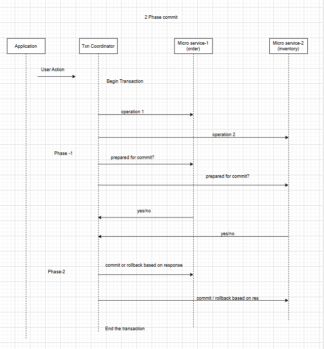

#### What is transaction

Introduction: it refers to set of tasks and group of tasks that needs to performed against the database.

Transaction has 4 properties

#### ACID
1. Atomicity:  if in the transaction we are doing some multiple tasks , if any of the tasks failed then we will revert back all the completed tasks to previous state .

2. Consistency: before and after the transaction data will be consistent

3. Isolation: if there are transaction running concurrently, they do not interface each other, if we are changing the some row data in the concurrent transactions only one transaction will able to changes the database based on locking strategies.

4. Durability: Ensures once transaction is committed , data are stored permanently, even in the system crash the data stays in the db.

#### How we achive the ACID properties in the distributed systems

Suppose we are storing the data in one db, we can use locking machinism at db level while doing transaction so that it follows all the principles.

but it's not scalable because we can not store huge datas in one db only, so we need to do db sharding (multiple databases).

i.e: for example we are building an online shopping website, to store the data we have created two data bases, one will keep order data and another will keep inventory data, so we may make two microservices handling each db.

There are couple of strategies to solve above issue

### How to handle transactions in distribute systems(database)

1. 2 phase commit (widley used across the industry)
2. 3 phase commit (enhanced version of two phase, very less used)
3. saga pattern (this is also popular)

#### Two phase commit

Introduction: if we are dealing with multiple microserverice in one transaction logic or it involves the multiple databse, if microservice/database fails to do change we must rollback all changes made to other database/microservices.

Note : in the two phase commit , participants can talk to each other.

Phase - 1: in this phase txn coordinator asks participants , are the ready for commit.

phase -2. based on participants voting txn coordinator decides to whether it should commit the txn or rollback it.

Please follow below img for more understanding.

How you are going to handle below use cases.
case 1. what if txn coordinator went down for sometime
case 2. what if participant is down for sometime.
case 3. what if communication breaks between txn coordinator and participants.

To tackle above problem we keep lock file for each layer and write the lock file before sending the data to other layer. 
in this we will be able to tacke all the use cases.(please think little loud).

#### 3 Phase commit

three phase commit is an extended version of 2 phase commit approach,
here we send pre commit message to each participant (decision taken by txn coordinator)

#### SAGA pattern
We have studied this pattern earlier, now i am going to give the overview only for your understanding.

Sagar pattern  can be used if there are many microservices are involved in the txn and txn are asyncronous in the nature, we proceed step by step and if txn failed at any step(microservice) microservice send the event for rollback so prev txn will be rollbacked .

