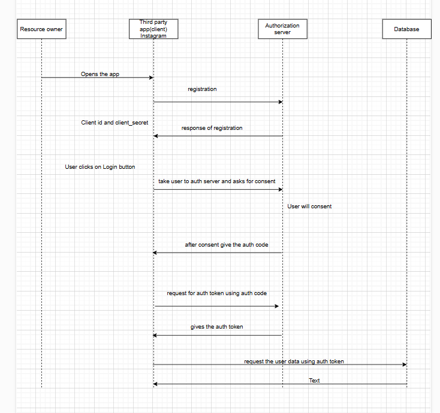

#### What is oAuth
it's open authorization, that is used to share the data between third party

##### Types of OAuth 

1. Authorization code grant (mostly used)
2. Resource password credentials(deprecated)
3. Refresh Token

##### Authorization token grant

