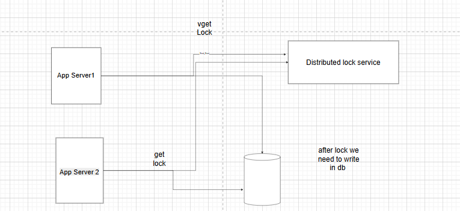

### Distributed locking

Why we need distributed locking when we have lock at db level

Answer: consider one use case suppose we have multiple application servers running on ec3 instance, and we have a file which we want to transform and save in some other file, transformation might take some time, so if two requests are coming concurrently and try to process that file and write transformed data in to destination file, it will create two problems first is resources wastage and another one changes of file corruption if two process wirte some contents at same time in one file.

#### How to implement distributed lock
in two cases we might need distributed locking, one is save duplication re computation and save resources , and another is for consistency or data correctness.

Below i am ging one diagram which handles 90% of problems using single instance of locking server

Diagram

In above diagram it is okay to have one instance of redis locking service when we are dealing with diplicate compution at worst it consume more cpu and cost some extra cloud charge, but when it comes to correctness we can not reply on above architecture because locking service is single point of failure

So how we can improve single point of failure
solution: we can add more instances for  locking service which means we can make some replicas one leader server is down we can send the request to newly selected leader, for leader selection we use consensus algorithm.

How do you handle if server 1 has been granted the lock and after that it went offline so that lock will stay foreover to overcome that we need to keep TTL(time to live) for each entry , afte certain timeout we remove the entry from cache, which introduce one genuine and less frequent problem as well, suppose server 1 has been granted lock and due to server 1 slowness it was not able to write in to the db before ttl so it will cause timeout, after ttl has been expired another server 2 came and took the lock so server 2 also can write in the same db.

{fency token approch} 
Above scenario can happen, in this use case we generte incremental id for each lock(using timestamp epoc or something else), so that when we write in the db sever we compare that uuid , if we got a request already which has higher uuid, we can reject later requests, but what about the use case when server 1 writes first and server 2 writes seccond, they also maintaint their uuid sequence as well, how do we handle such use cases.

