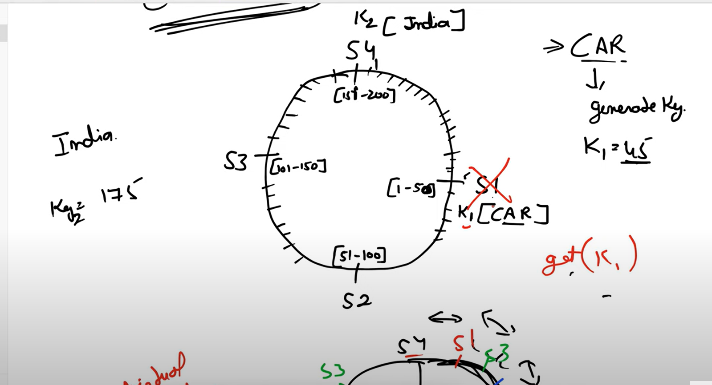
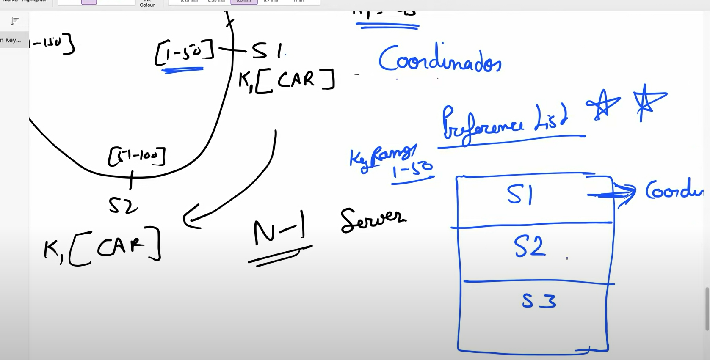
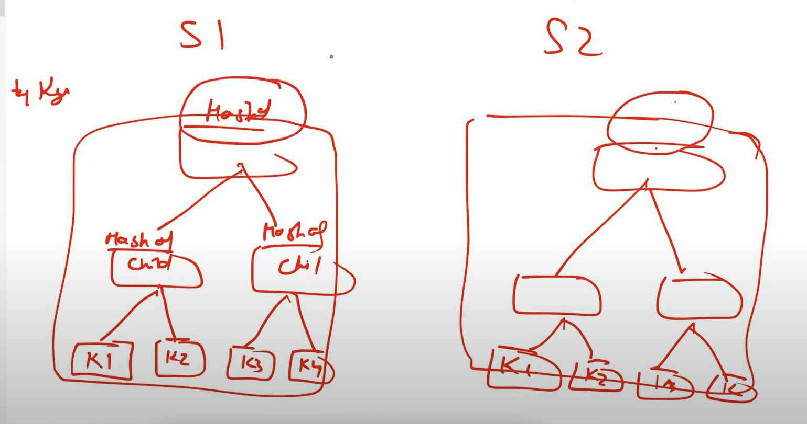

#### Design key value store

Amazon is using DynamoDb as key value store for cart databases.

What are the goals for the key value store feature

#### Goals
  1. Sacalability
  2. Decentralization
  3. Eventual Consistency

  In following steps we will cover this topic

   step 1. Database partition
   step 2.  Database replication
   step3. get and put operation.
   step 4. data versioning
   step 5. gossip protocols
   step 6. Merkle tree (to ensure data consistency in distributed systems)

#### Data base partition

  We can not store large data in one db server or at one place only, we need to have more db servers at different location to increase scalabilty.

  for this we would use consistence hashing

  

based on hash value we will redirect the request to a specific server.

suppose we are getting input car and hash function return hash value 45 the it will be handled by server S1 as given in the image.
india => 175 => will be handled by server S4.

to overcome the hot keys issue we use vertual node stategies so that we can distrbute the data evenly to every servers.

#### Database server replication.

what if there is a fire in server wharehouse, how to overcome such use case, for that we need to have database server replication to other db server so that we do not lose the data.

#### Get and Put operations.
In case of replication we need to have some confirmations from other replication in order to fulfill the user request.

suppose we have N replication for a server the we should follow

R(read requests) + W (write Requests) > N (number of replicas).

#### Data Versioning(Vector clock)N

Data versioning help use to keep data consistency. for each data we keep version , if there is a mismatch in the version we update the all replica servers based on latest written data and now each replica severs has same data value.

#### Merkle Tree

How do we make sure that two replica servers has latest data in sync, one way is to compare each data and another way is merkle three that help use to how much data part is different that needs to be synced, this fast compare to naive approach.

Note: Dynamo DB uses Merkle tree

CAP: C is missing in Dyanamo Db for high availabilty.